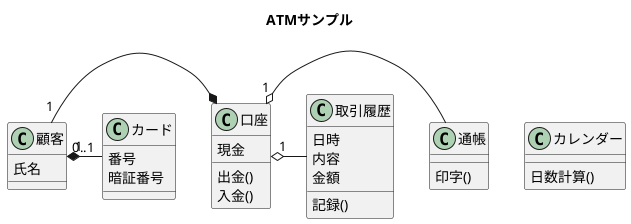
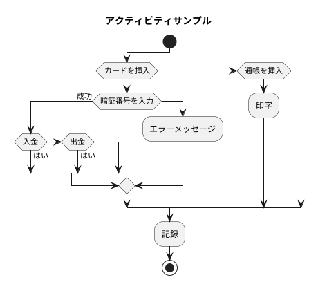

#コードレビュー
現金を価値・個数の構造体配列にしていたが、価値はコード内で不変であるため分離してleadonlyにした
Cashs.cs
```
struct Cashs
{
    public int[] quantity={0,0,0,0,0,0,0,0,0};
    public static readonly int[] Worth={10000,5000,1000,500,100,50,10,5,1};
```

指定の価値を持つ貨幣のindexを取得するための検索効率が悪かったため
Transaction.cs
```
        result.quantity[Array.IndexOf(Cashs.Worth, after)] = amount / after;
```

各所にコメントを追加

初期所持金を調整しやすいようにコンストラクタに引数をとって設定できるようにした
Account.cs
```
    public Account(){}
    public Account(int money)
    {
        this.money=money;
    }
```