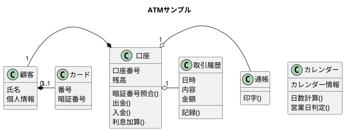
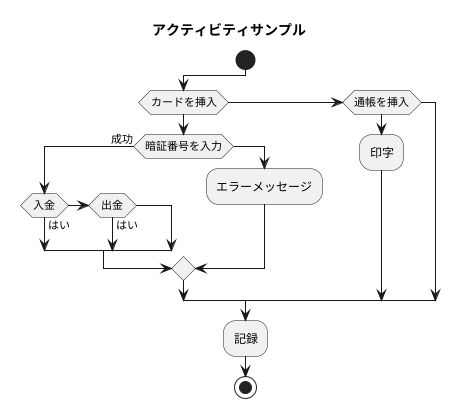

#H
##H2
###H3

```aaaaaaaaaaaaaaa```

```printf("aaaaa");```


```puml

@startuml

title ATMサンプル

class 口座 {
口座番号
残高
暗証番号照合()
出金()
入金()
利息加算()
}

class 顧客 {
氏名
個人情報
}

class 取引履歴 {
日時
内容
金額
記録()
}

class カード {
番号
暗証番号
}

class カレンダー{
    カレンダー情報
    日数計算()
    営業日判定()
}

class 通帳{
    印字()
}

顧客 "1" -* 口座
顧客 "1" *- "0..1" カード

口座 "1" o- 通帳
口座 "1" o- 取引履歴

@enduml

```


```puml
@startuml
title アクティビティサンプル

start 
if(カードを挿入)
    if(暗証番号を入力) then (成功)
        if(入金) then (はい)
        elseif(出金) then (はい)
        endif
    else
        :エラーメッセージ;
    endif
elseif(通帳を挿入)
    :印字;
endif

:記録;
stop

@enduml

```